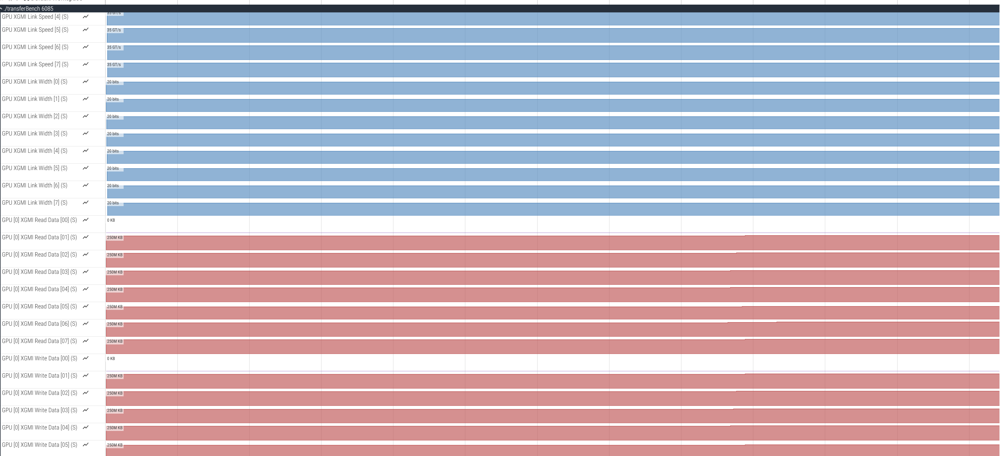
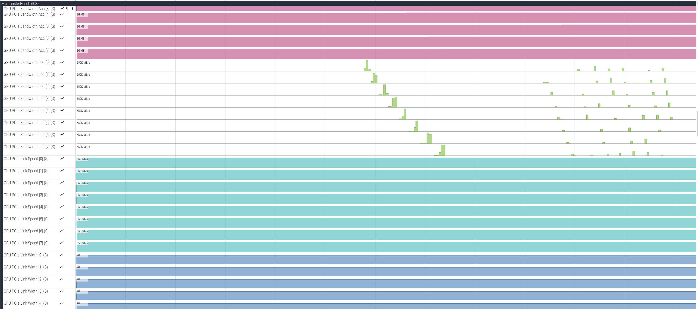

.. meta::
   :description: ROCm Systems Profiler XGMI and PCIe metrics sampling and monitoring
   :keywords: rocprof-sys, rocprofiler-systems, ROCm, tips, how to, profiler, tracking, XGMI, PCIe, GPU connectivity, AMD

***********************************************
XGMI and PCIe metrics sampling and monitoring
***********************************************

`ROCm Systems Profiler <https://github.com/ROCm/rocm-systems/tree/develop/projects/rocprofiler-systems>`_ supports
sampling of XGMI and PCIe interconnect metrics. It allows you to gather key performance metrics for
GPU-to-GPU communication via XGMI links, and CPU-to-GPU communication via PCIe links. This information can be used
to optimize multi-GPU workloads, identify communication bottlenecks, and analyze data transfer efficiency
in high-performance computing applications.

Sampling support
=================

Sampling of XGMI and PCIe interconnect metrics is supported by leveraging `AMD SMI <https://rocm.docs.amd.com/projects/amdsmi/en/latest/>`_ which provides the interface for GPU metric collection. Follow the steps:

1. Set the ``ROCPROFSYS_USE_AMD_SMI`` environment variable to enable GPU metric collection:

.. code-block:: shell

  export ROCPROFSYS_USE_AMD_SMI=true

2. Update the ``ROCPROFSYS_AMD_SMI_METRICS`` variable to collect the XGMI and PCIe metrics. The default value is:

.. code-block:: shell

  ROCPROFSYS_AMD_SMI_METRICS=busy,temp,power,mem_usage

To include XGMI and PCIe metrics, update it to:

.. code-block:: shell

  ROCPROFSYS_AMD_SMI_METRICS=busy,temp,power,mem_usage,xgmi,pcie

Alternatively, you can use the following to collect all available GPU metrics:

.. code-block:: shell

  ROCPROFSYS_AMD_SMI_METRICS=all

XGMI metrics
------------

XGMI (AMD Infinity Fabric™ XGMI) provides high-bandwidth, low-latency GPU-to-GPU interconnects in multi-GPU systems. The following XGMI metrics are collected:

- **XGMI Link Width**: The number of active XGMI links between GPUs
- **XGMI Link Speed**: The speed of XGMI links (in GT/s)
- **XGMI Read Data**: Accumulated data read through each XGMI link (in KB)
- **XGMI Write Data**: Accumulated data written through each XGMI link (in KB)

These metrics help identify GPU-to-GPU communication patterns and bandwidth utilization in multi-GPU workloads.

.. note::

   XGMI metrics are only available on systems with multiple GPUs connected via XGMI links.
   The availability depends on the system topology and GPU architecture. If unsupported or not
   available, the values will be reported as N/A in the output.

PCIe metrics
------------

PCIe (PCI Express) provides the connection between the CPU and GPU. The following PCIe metrics are collected:

- **PCIe Link Width**: The number of PCIe lanes currently active
- **PCIe Link Speed**: The current PCIe link generation and speed (e.g., Gen3, Gen4, Gen5)
- **PCIe Bandwidth Accumulated**: Total bandwidth accumulated over time (in MB)
- **PCIe Bandwidth Instantaneous**: Instantaneous bandwidth at the time of sampling (in MB/s)

These metrics help analyze CPU-to-GPU data transfer efficiency and identify PCIe bottlenecks.

Using TransferBench for testing
================================

For testing and benchmarking GPU connectivity, you can use the `TransferBench <https://rocm.docs.amd.com/projects/TransferBench/en/latest/index.html>`_.
TransferBench is a benchmarking utility designed to measure the performance of simultaneous data transfers between user-specified devices, such as CPUs and GPUs.
For this example, TransferBench is used to profile XGMI and PCIe traffic for analysis.

1. Source the ROCm Systems Profiler Environment using:

.. code-block:: shell

   source /opt/rocprofiler-systems/share/rocprofiler-systems/setup-env.sh

Alternatively, if you are using modules, use:

.. code-block:: shell

   module use /opt/rocprofiler-systems/share/modulefiles

2. Generate and configure the profiler config file.

.. code-block:: shell

   rocprof-sys-avail -G $HOME/.rocprofsys.cfg -F txt
   export ROCPROFSYS_CONFIG_FILE=$HOME/.rocprofsys.cfg

Edit ``.rocprofsys.cfg`` with the following settings:

.. code-block:: shell

  ROCPROFSYS_USE_AMD_SMI     = true
  ROCPROFSYS_AMD_SMI_METRICS = busy,temp,power,mem_usage,xgmi,pcie
  ROCPROFSYS_ROCM_DOMAINS    = hip_runtime_api,memory_copy,hsa_api

3. Profile the TransferBench application.

.. code-block:: shell

  rocprof-sys-sample -PTHD -- ./TransferBench a2a

.. note::

   Refer to these steps to `Install and build TransferBench <https://rocm.docs.amd.com/projects/TransferBench/en/latest/install/install.html#install-transferbench>`_.

At the end of the run, a similar message appears::

  [rocprofiler-systems][964294][perfetto]> Outputting '/home/demo/rocprofsys-transferBench-output/2025-04-25_15.52/perfetto-trace-964294.proto'
  (3124.52 KB / 3.12 MB / 0.00 GB)... Done

To view the generated ``.proto`` file in the browser, open the
`Perfetto UI page <https://ui.perfetto.dev/>`_. Then, click on
``Open trace file`` and select the ``.proto`` file. In the browser, you can visualize the XGMI and PCIe metrics.

The visualization will show:

- **XGMI Read Data** and **XGMI Write Data** tracks showing data transfer through XGMI links over time
- **XGMI Link Width** and **XGMI Link Speed** tracks showing link configuration
- **PCIe Bandwidth** tracks showing CPU-to-GPU data transfer rates
- **PCIe Link Width** and **PCIe Link Speed** tracks showing PCIe link configuration

Tips for effective profiling
=============================

1. **Multi-GPU workloads**: XGMI metrics are most useful when profiling applications that use multiple GPUs and transfer data between them.

2. **Sampling frequency**: Adjust the sampling frequency using ``ROCPROFSYS_PROCESS_SAMPLING_FREQ`` (default is 50Hz) to capture more or fewer samples based on your analysis needs.

3. **Focus on specific metrics**: If you only need XGMI or PCIe metrics, you can specify just those:

   .. code-block:: shell

     ROCPROFSYS_AMD_SMI_METRICS=xgmi  # Only XGMI metrics
     ROCPROFSYS_AMD_SMI_METRICS=pcie  # Only PCIe metrics

4. **Combine with API tracing**: For detailed analysis, combine XGMI/PCIe metrics with HIP/HSA API tracing to correlate data transfers with application behavior:

   .. code-block:: shell

     ROCPROFSYS_ROCM_DOMAINS=hip_runtime_api,memory_copy,kernel_dispatch,hsa_api

Exploring available metrics
============================

To explore all supported metrics and domains, use the following commands:

.. code-block:: shell

  rocprof-sys-avail --all                    # Show all available options
  rocprof-sys-avail -bd -r AMD_SMI_METRICS   # Show AMD SMI metrics
  rocprof-sys-avail -bd -r ROCM_DOMAINS      # Show ROCm tracing domains

For more details on ROCm Systems Profiler configuration, refer to the `configuration guide <configuring-runtime-options.html>`_.
